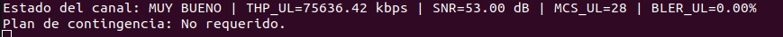
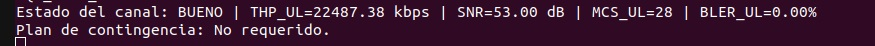
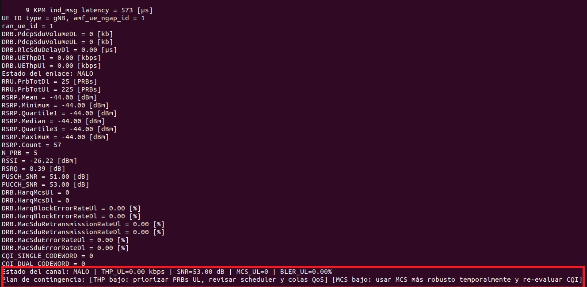

# Monitoreo de calidad de canal en OAI/FlexRIC

## Descripción general

El siguiente repositorio contiene la modificación de una xApp de monitoreo de métricas KPM en el entorno FlexRIC/OAI, con el objetivo de clasificar el estado del enlace de cada UE y brindar un posible caso de contingencia.

## Tecnologías utilizadas

- Ubuntu 22.04.5 LTS de 64 bits.
- OpenAirInterface.
- FlexRIC.
- xApp de monitoreo KPM.
- Lenguaje C.
- Métricas KPM para monitoreo de UEs.

## Entorno de ejecución

Las pruebas se realizaron sobre Ubuntu 22.04.5 LTS de 64 bits. La máquina utilizada contaba con un procesador Intel Core i7-12700 de 12.ª generación, 16 GB de memoria RAM, gráficos integrados Intel UHD Graphics 770 y un disco de 500 GB.

## Funcionalidad agregada

Se agregó una lógica de clasificación del estado del enlace para cada UE monitoreado por la xApp.

A partir de las métricas recibidas mediante los reportes KPM, la xApp evalúa el estado observado y asigna una clasificación cualitativa del enlace.

Las clasificaciones consideradas son:

- `MALO`
- `BUENO`
- `MUY BUENO`

## Métricas utilizadas

La xApp modificada utiliza las siguientes métricas para determinar el estado observado del enlace:

| Métrica | Descripción |
|---|---|
| Throughput uplink | Tasa de datos transmitida por el UE hacia la red. |
| SNR | Relación entre la potencia de señal y el nivel de ruido. |
| MCS uplink | Esquema de modulación y codificación utilizado en uplink. |
| BLER uplink | Porcentaje de bloques recibidos con error. |

## Criterio de clasificación del enlace

La xApp clasifica el estado observado del enlace en tres casos posibles: `MALO`, `BUENO` y `MUY BUENO`.

| Estado | Criterio |
|---|---|
| `MALO` | THP UL < 10000 kbps, SNR < 35 dB, MCS UL < 20 o BLER UL > 2 %. Se cumple si al menos una de estas condiciones ocurre. |
| `BUENO` | Caso intermedio. No cumple las condiciones para `MALO`, pero tampoco cumple todas las condiciones para `MUY BUENO`. |
| `MUY BUENO` | THP UL ≥ 23000 kbps, SNR ≥ 45 dB, MCS UL ≥ 26 y BLER UL ≤ 1 %. Se cumple si todas estas condiciones ocurren. |

## Sugerencias de diagnóstico ante casos degradados

Cuando el enlace es clasificado como `MALO`, la xApp modificada identifica cuál de las métricas evaluadas provocó la degradación y muestra en consola una sugerencia básica de diagnóstico.

Las métricas consideradas para estas sugerencias son:

| Métrica afectada | Condición detectada | Sugerencia |
|---|---|---|
| Throughput uplink | THP bajo | Revisar la asignación de PRBs UL, el scheduler y las colas de QoS. |
| SNR | SNR baja | Revisar potencia UL, interferencia, beamforming o handover. |
| MCS | MCS bajo | Utilizar un MCS más robusto temporalmente y volver a evaluar el CQI. |
| BLER | BLER alto | Reforzar HARQ, bajar el MCS objetivo y validar el transporte. |

## Archivo modificado

La xApp modificada se encuentra en el archivo:

```bash
flexric/examples/xApp/c/monitor/xapp_kpm_moni.c
```

Luego de realizar cambios en la xApp, se deben guardar las modificaciones y aplicar nuevamente los archivos de parche. Para ello, se debe ingresar al siguiente directorio:

```bash
cd O-RAN-Testbed-Automation/OpenAirInterface_Testbed/RAN_Intelligent_Controllers/Flexible-RIC/additional_scripts
```

Y ejecutar:

```bash
./apply_changes_to_patch_files.sh
```

## Ejecución

### Levantar el core 5G

```bash
cd "5G Core Network"
./run.sh
```

### Levantar el gNB

En otra terminal:

```bash
cd "Next Generation Node B"
./run.sh
```

### Levantar el UE

En otra terminal:

```bash
cd "User Equipment"
./run.sh
```

Para levantar otro UE, ejecutar en otra terminal:

```bash
./run.sh 2
```

### Levantar FlexRIC

```bash
cd "RAN Intelligent Controllers/Flexible-RIC"
./run.sh
```

### Ejecutar la xApp modificada

Luego de levantar FlexRIC, ejecutar la xApp modificada:

```bash
./run_xapp_kpm_moni.sh
```
### Generar tráfico uplink desde los UEs

Si se desea generar tráfico desde los UEs hacia la red, se debe abrir una terminal bash asociada al UE correspondiente y ejecutar el comando de generación de tráfico utilizado en el entorno de pruebas.

Por ejemplo:

```bash
sudo ip netns exec ue1 bash
```

Luego, dentro de esa terminal, ejecutar el comando correspondiente para generar tráfico uplink.

```bash
# iperf -c X.X.X.X -u -b 50M -t 60
```
## Salida esperada en consola

Una vez ejecutada la xApp modificada, la consola muestra las métricas KPM recibidas para cada UE monitoreado y ademas se imprime la clasificación del estado observado del enlace de acuerdo con los umbrales definidos.


### Enlace clasificado como MUY BUENO

En este caso, las métricas evaluadas se encuentran dentro de valores favorables.



### Enlace clasificado como BUENO

En este caso, el enlace no presenta una degradación clara, pero tampoco cumple todas las condiciones necesarias para ser clasificado como `MUY BUENO`.



### Enlace clasificado como MALO

En este caso, al menos una de las métricas evaluadas presenta un valor degradado. La xApp muestra la clasificación del enlace y una sugerencia de diagnóstico asociada.


### Caso sin tráfico uplink

Cuando no hay tráfico uplink activo, la xApp puede clasificar el enlace como `MALO` debido al bajo throughput. Este caso no necesariamente representa una degradación real del enlace, sino una situación en la que no hay tráfico suficiente para evaluar correctamente la transmisión.


## Configuración del canal RFS

Para realizar pruebas con el canal RFS, el nivel de ruido del canal se modifica desde los archivos de configuración del UE y del gNB. Es importante cambiar el valor en ambos archivos, ya que los dos componentes incluyen una definición del canal.

Los archivos a modificar son:

```bash
User_Equipment/configs/channelmod_rfsimu_LEO_satellite.conf
Next_Generation_Node_B/configs/channelmod_rfsimu_LEO_satellite.conf
```

Dentro de ambos archivos se debe modificar el parámetro:

```bash
noise_power_dB = -100;
```

El valor de `noise_power_dB` permite configurar el nivel de ruido del canal. En las pruebas realizadas se utilizaron distintos valores para representar condiciones favorables, intermedias y degradadas del enlace.

| Escenario | Valor configurado | Condición evaluada |
|---|---:|---|
| Canal RFS favorable | `noise_power_dB = -100;` | Enlace con bajo nivel de ruido. |
| Canal RFS intermedio | `noise_power_dB = -50;` | Enlace con condición intermedia. |
| Canal RFS degradado | `noise_power_dB = -5;` | Enlace degradado por mayor nivel de ruido. |

Luego de modificar el valor, se deben guardar los cambios.
## Instalación

Para instalar el entorno, primero se debe clonar este repositorio:

```bash
git clone https://github.com/lourdesconti998-netizen/OranTech_oai_RSF.git
```

Luego, ingresar al directorio del entorno basado en OpenAirInterface y FlexRIC:

```bash
cd implementacion2/O-RAN-Testbed-Automation/OpenAirInterface_Testbed
```

Ejecutar la instalación completa:

```bash
./full_install.sh
```

Este script descarga, compila e instala los componentes necesarios del entorno, incluyendo Open5GS, OpenAirInterface y FlexRIC. El proceso puede demorar varios minutos dependiendo de los recursos de la máquina.

Una vez finalizada la instalación, los componentes principales quedan disponibles en los siguientes directorios:

```text
5G_Core_Network/
Next_Generation_Node_B/
User_Equipment/
RAN_Intelligent_Controllers/Flexible-RIC/
```
Nota 1: La base de esta implementación fue extraida del la tesis de Juan Navarro Gutierrez "O-RAN: Puerta de entrada para nuevos investigadores"
Nota 2: Se utilizaron herramientas de inteligencia artificial como apoyo en procesos puntuales de instalación y depuración.
